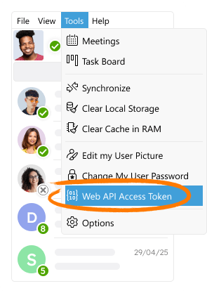

# Authentication with Token

A Web API access token can be used to send Web API requests. This in an alternative to [authenticating with a username and password](./login.md), 
and can be useful if you need to execute individual API requests, as the token is sent alone with the request as a part of the request header.

To obtain a Web API token, open the Virola Client main menu and go to **Tools -> Web API Access Token**



The token links your user profile with the Web API calls you make, so **all calls will be performed on your behalf**.

> Note! Once you generate a new token, any previously generated token will stop working.


Example Web API request with token authentication, sent using *curl*:

```bash
curl -k -X GET \
	-H "Authorization: Bearer TOKEN" \
	https://HOST:PORT/api/v1/server-health
```

### Related Endpoints

- [POST /api/v1/login](login.md) - Start a new session
- [GET /api/v1/logout](logout.md) - Terminate the current session
- [GET /api/v1/status](status.md) - Check if session is active